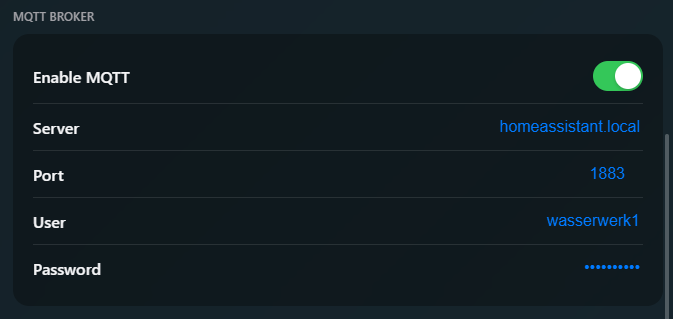

# MQTT

The current MQTT Implementation is compatible with the latest 3.1.1 Protocol.

### Setup

When enabling MQTT make sure, the Device can reach the MQTT Server.

### Structure

- <prefix\>
    - channel
        - 1
            - state
            - duration
        - 2
            - state
            - duration
    - voltage
    - cpu
    - status
    - operation
        - mode
        - fill
        - pump