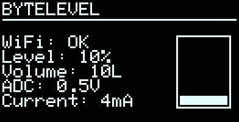
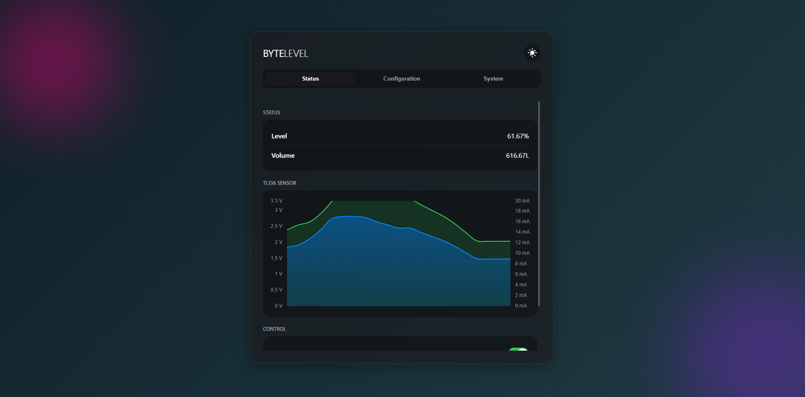
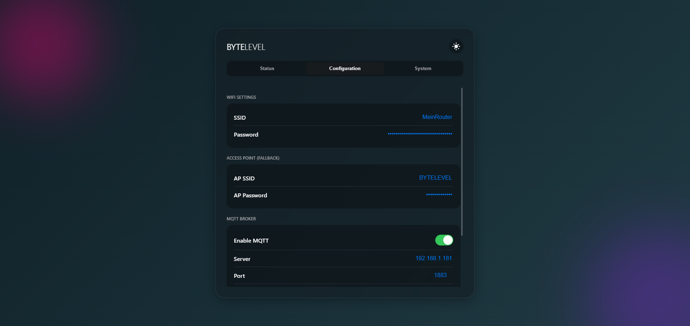
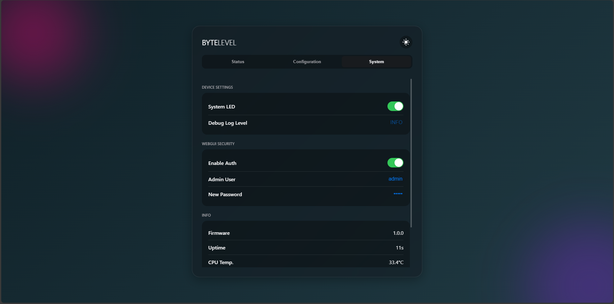

# ByteWaterlevel

ByteWaterlevel in Short (BYTELEVEL) is a Device to Monitor Wells, Cisterns and co.
It uses an TL136 Sensor to monitor the Fluid Level, but it works with all 4–20 mA Sensors.

It comes with two Relais to control Pumps, Sirens or other Appliances.

The Device is designed only to work with external Antennas to provide a good Wi-Fi Range.

## Features:

- HTTP API
    - Basic Auth
    - Enable/Disable Relais
    - Enable Relais for a given Time period
    - Restart Device
    - Save Configuration
    - Get Device Info (CPU Temperature, Sensor etc...)
- MQTT
- WiFi
    - AP Mode
    - Client Mode
    - OTA
        - Server
        - Client
- USB
    - Flashing
    - JTAG
- Fastboot (Device is ready in under 1 Second)
- GUI
    - Status
    - Configuration
    - Info
- Calculations
    - Calibration
    - Tank Level in %
    - Tank Level in L (Works with rectangular / upright round / horizontal round tanks)
- OLED
- EMA Filter

Planned:

- Update Config after Update with new Keys/Values from Backup File.

## Specifications:

* Input: 12–24 V (with Reverse protection)
* USB: Micro USB (with Overvoltage protection)
* MCU: ESP32 C3
* Relais current (peak): **max 10A**
* Power consumption: low
* Sensor: TL136 (Optional with Overvoltage protection)

### Working Principle

ByteWaterlevel is a Current to Voltage Converter for the Liquid Sensor TL-136 that outputs a current between 4–20 mA.

The supply Voltage for the Board is designed for 24 V, but the board has a Buck converter which allows supply voltage
from 12 to 26 V.

An OP-Amp is used to amplify the Voltage Drop on a 120-Ohm Resistor.

The Sensor is tied directly to VCC In, so please use a good power supply otherwise the measurement tolerance can be big.

## Display

You can add an SSD1306 (I²C 128x64) Display to the Device.

## Setup

For Setup please have a Look into <a href="./SETUP.md">SETUP.md</a>.

## Automation

The Device comes with integrated Automation Functions for more Information look at <a href="./AUTOMATION.md">
AUTOMATION.md</a>.

## Factory reset:

For Factory reset have a Look into <a href="./RESET.md">RESET.md</a>.

## API Docs

For API Docs please have a Look into <a href="./API.md">API.md</a>.

## Used Software

- esp32async/ESPAsyncWebServer
- esp32async/AsyncTCP
- anchon/ArduinoJson
- bertmelis/espMqttClient
- Arduino
- chrisjoyce911/esp32FOTA

## Screenshots

### Status

The Status Page contains a Chart about the Sensors Analogs Values.

- Voltage
- Current

On the Top it calculates the Tank Level in Percentage and Tank Volume in Liters.

At the Bottom you can manually enable/disable the Relais on the Board.

### Configuration

On the Configuration Page you can change MQTT, Wi-Fi and Access Point Credentials.

You can calibrate the Sensor and ADC here.

### System

On the System Tab you can enable/disable OTA and Authentification.

You can set the Behavior of the System LED and much more.

## Disclaimer

**As this is a prototype, we accept no liability for damage to persons or buildings.**

**Any warranty is excluded.**

**The device should be installed by a qualified electrician in accordance with VDE regulations.**
