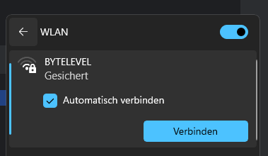

# Setup

## Initial Setup

When powering up the Device for the first Time, it opens an WiFI AP, you need then to connect to the WiFi.

#### Default Credentials:

Password: **BYTESTORE**

After connecting to the Device, open a Webbrowser on your System and open http://10.10.10.1 to open the WebUI.

Fill in your WiFi Credentials you want to connect to and press "Save", the Device will now reboot and connect to your
WiFi Network.
