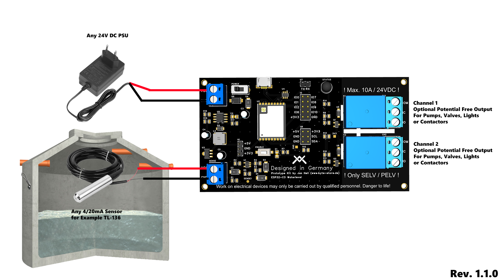

# Setup

## Firmware Setup

If you received a blank ESP32 on your board, or you damaged the firmware, please look at <a href="./FLASH.md">
FLASH.md</a>.

## Initial Setup

When powering up the Device for the first Time, it opens a Wi-Fi AP, you need then to connect to the Wi-Fi.

#### Default Credentials:

Password: **BYTESTORE2026**

After connecting to the Device, open a Webbrowser on your System and open http://10.10.10.1 to open the WebUI.

Fill in your Wi-Fi Credentials you want to connect to and press "Save", the Device will now reboot and connect to your
Wi-Fi Network.

## Installation

### Case

You can order or print yourself a Shell for the PCB.

There are currently two designs, one for a DIN Rail aka (Hutschiene) and one with Screw Mounts.

The circuit board is coated with a protective lacquer to protect it from moisture, but the housing does not offer full
protection, which is why a waterproof box is profitable for outdoor installation.

### Basic Wiring

Please only use SELV Voltage, you can control big Pumps, for example, with external Contactors.

Work should always be carried out in accordance with local guidelines, e.g. VDE. We accept no liability for personal
injury, property damage, or other damage.

Please note that the relay channels are only designed for 10A for short periods; external contactors should be used for
continuous loads.
